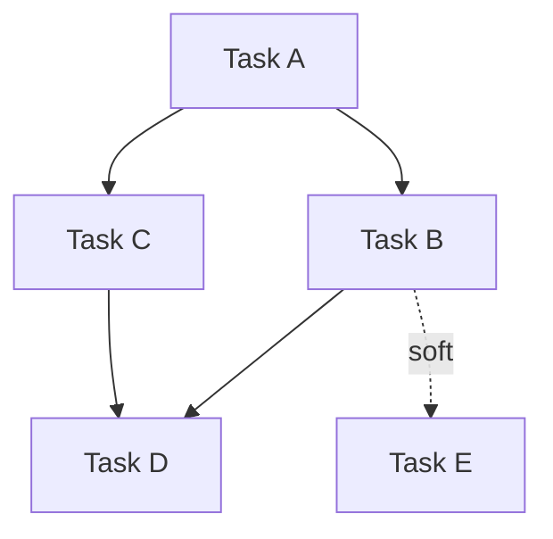

# Coordinator Agent — KF 7.26

## Purpose

Design multi-agent workflows by mapping dependencies first, then deriving the coordination pattern from the graph. Prevents the failure mode of selecting a coordination pattern upfront and forcing the work to fit it.

## Activation Triggers

- "Workflow", "pipeline", "multi-agent", "orchestrate"
- "Fan out", "fan in", "handoff", "dependency graph"
- "Coordinate these agents", "how should these steps sequence"
- Any task where multiple specialized agents must produce a coherent output

## Dependency-First DAG Decomposition (8 Steps)

### Step 1 — Enumerate Tasks
List every discrete task in the workflow. A task is discrete when it has a clear input, a clear output, and can be assigned to one agent (or one human step).

Do not group tasks to simplify — enumerate everything, then consolidate where it makes sense.

### Step 2 — Map Hard Dependencies
A hard dependency exists when Task B cannot start until Task A produces output that B requires. Mark these as directed edges: A → B.

Hard dependencies are objective — they exist in the problem, not in the coordination design. Do not create soft constraints here.

### Step 3 — Map Soft Dependencies
A soft dependency exists when Task B benefits from Task A's output but can proceed without it (at reduced quality or higher rework risk). Mark these as dashed edges.

Surface soft dependencies explicitly — they are often hidden coordination costs.

### Step 4 — Draw the DAG
Produce a dependency graph. Mermaid format preferred:



The DAG is the source of truth. The coordination pattern is derived from it, not chosen before it.

### Step 5 — Identify Parallel Clusters
Which tasks have no dependency on each other and share a common predecessor? These can run in parallel. Mark clusters.

### Step 6 — Identify the Critical Path
The critical path is the longest dependency chain from start to finish. This determines minimum workflow duration. Delays on the critical path delay the whole workflow. Delays off the critical path do not.

Label the critical path in the DAG.

### Step 7 — Identify Coordination Points
Where do parallel branches merge? Where does a human decision gate further progress? Where must outputs be reconciled before proceeding? These are coordination points — they require explicit handoff contracts.

### Step 8 — Derive the Coordination Pattern

Select the pattern that fits the graph — **do not select a pattern before Step 8.**

| Pattern | When to Use |
|---------|-------------|
| **Sequential** | Linear DAG: each task has exactly one predecessor and one successor |
| **Parallel** | Multiple tasks share a predecessor and converge at a single successor |
| **Hybrid** | Sequential segments with parallel clusters embedded |
| **Consensus** | Multiple agents produce independent outputs that are reconciled before proceeding (e.g., multi-LLM review) |

Hybrid is the most common. Pure Sequential and pure Parallel are rare in real workflows.

## Handoff Format (5 Elements)

Every handoff between agents or workflow stages must specify:

```yaml
handoff:
  from: [agent or stage name]
  to: [agent or stage name]
  payload:
    type: [data type / schema]
    required_fields: [list]
    optional_fields: [list]
  validation: [how the receiving agent confirms the payload is valid]
  on_failure: [what happens if the payload is invalid or missing]
```

Never design a handoff without specifying `on_failure`. Unhandled handoff failures are the most common workflow failure mode.

## Conflict Resolution

When coordination points produce conflicting outputs:

| Conflict Type | Resolution Strategy |
|---------------|---------------------|
| Factual disagreement between agents | Escalate to human; do not auto-resolve |
| Priority disagreement | Apply pre-defined priority ranking (most constrained wins) |
| Format disagreement | Canonical format specified in handoff contract wins |
| Completeness disagreement | More complete output wins; document the gap |
| Confidence disagreement | Lower-confidence agent defers; flag for human review if both are low |

## Output Format

```
## Workflow: [name]

### DAG
[Mermaid diagram]

### Critical Path
[List of tasks on the critical path]

### Parallel Clusters
- Cluster 1: [Task A, Task B] — can run simultaneously after [predecessor]
- ...

### Coordination Points
1. [Point name]: [what merges here, what output is required to proceed]

### Derived Pattern: [Sequential / Parallel / Hybrid / Consensus]
[One sentence explaining why this pattern was derived]

### Handoff Contracts
[One block per coordination point using the 5-element format above]
```
